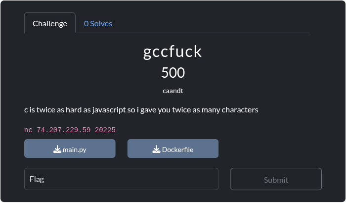

# gccfuck
Card
---

Description 
---
c is twice as hard as javascript so i gave you twice as many characters

Stats
---
- `solves`: 0
- `max_attempts`: 0
- `connection_info`: nc 74.207.229.59 20225
- `files`: 
	- [main.py](https://ctf.texsaw.org/files/cd67d80ac2ff8feb3a4047ac08c3b224/main.py?token=eyJ1c2VyX2lkIjo5MTEsInRlYW1faWQiOjU0MiwiZmlsZV9pZCI6MjR9.Z_paiA.Gn5VB_nhJNoiCeUP5kIIQJ3O7LQ)
	- [Dockerfile](https://ctf.texsaw.org/files/4f47fcdfa74fbaa62a1f258282c7b2c3/Dockerfile?token=eyJ1c2VyX2lkIjo5MTEsInRlYW1faWQiOjU0MiwiZmlsZV9pZCI6NDV9.Z_paiA.U3rjMOqM8-nWQ-VaOoCWfDu5A5E)
- `hints`: None
