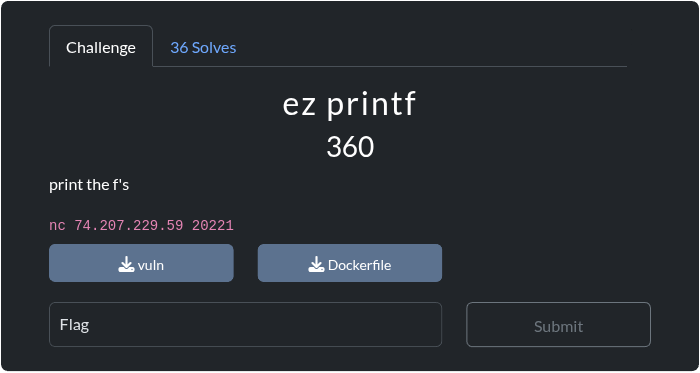

# ez printf
Card
---

Description 
---
print the f's

Stats
---
- `solves`: 36
- `max_attempts`: 0
- `connection_info`: nc 74.207.229.59 20221
- `files`: 
	- [vuln](https://ctf.texsaw.org/files/55f47344566dd13d8df40479664d5354/vuln?token=eyJ1c2VyX2lkIjo5MTEsInRlYW1faWQiOjU0MiwiZmlsZV9pZCI6MjF9.Z_pahw.sWD9AxDGasJMv3GFD3dK4hBf22I)
	- [Dockerfile](https://ctf.texsaw.org/files/d8d19c16a867faac909a5095ca217e7f/Dockerfile?token=eyJ1c2VyX2lkIjo5MTEsInRlYW1faWQiOjU0MiwiZmlsZV9pZCI6NTV9.Z_pahw.jcnv8JkiMy42Q3OYq2UidcEGm3Y)
- `hints`: None
