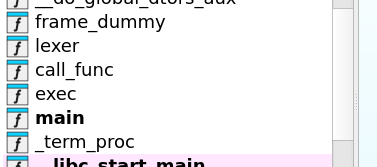

# Intro
i was a author for 1ng3neerCTF 2025 edition, i made 3 reverse challs, and here is the writeup for them.  
i mainly do pwn so you can see some hints of pwn in those challs hehe, but still they are reversable.       

# `NotBF`
#### Description
just a fun "programming lang" i made :)
#### Files
- <a href="/Blog/1ng3neerCTF/NotBF/rev">rev</a>
## Chall
this easy reverse chall that expects from you to reverse the bf like language and figure out how to use it read the flag from the server.             

in ida we can three function:
- lexer , exec and call_func
`lexer` function job is to convert the language src to symbols to make it easy to execute them later.      

<details>
<summary>lexer (after ai cleaning)</summary>

```c
#include <stdlib.h>
#include <stdint.h>

_QWORD *__fastcall lexer(_QWORD *a1, _BYTE *a2)
{
    int64_t capacity = 0;
    int64_t length = 0;
    uint32_t *tokens = NULL;

    while (*a2)
    {
        // Expand the buffer if needed
        if (length == capacity)
        {
            capacity = capacity ? 2 * capacity : 2;
            tokens = realloc(tokens, 4 * capacity);  // each token is 4 bytes (uint32_t)
        }

        // Match tokens
        if (*a2 == '-' && a2[1] == '>')
        {
            tokens[length++] = 0;
            a2 += 2;
        }
        else if (*a2 == '<' && a2[1] == '-')
        {
            tokens[length++] = 1;
            a2 += 2;
        }
        else if (*a2 == '-')
        {
            tokens[length++] = 5;
            a2++;
        }
        else if (*a2 == '+')
        {
            tokens[length++] = 4;
            a2++;
        }
        else if (*a2 == 'P' && a2[1] == 'P')
        {
            tokens[length++] = 3;
            a2 += 2;
        }
        else if (*a2 == 'P')
        {
            tokens[length++] = 2;
            a2++;
        }
        else
        {
            a2++; // Skip unrecognized characters
        }
    }

    // Store result in a1
    a1[0] = length;
    a1[1] = capacity;
    a1[2] = (uintptr_t)tokens;
    return a1;
}
```

</details>


- `exec` function job takes the output of the lexer and executes it.     

<details>
<summary>exec (after ai cleaning)</summary>

```c
#include <stdlib.h>
#include <assert.h>
#include <stdint.h>

extern uint8_t Mem[256];
extern uint8_t Cur;
extern size_t Stack;
extern size_t size;
extern void *ptr;
extern void call_func(void);

unsigned __int64 __fastcall exec(
    __int64 a1,
    __int64 a2,
    __int64 a3,
    __int64 a4,
    __int64 a5,
    __int64 a6,
    unsigned __int64 a7,  // number of instructions
    int a8,
    __int64 a9            // pointer to instruction array
)
{
    for (int i = 0; i < a7; ++i)
    {
        uint32_t opcode = *(_DWORD *)(4LL * i + a9);

        switch (opcode)
        {
            case 0: // Move right
                Cur = (Cur + 1) & 1;
                break;

            case 1: // Move left
                Cur = (Cur - 1) & 1;
                break;

            case 2: // Push to stack or call_func
                if (Cur)
                {
                    if (Stack == size)
                    {
                        size = size ? 2 * size : 2;
                        ptr = realloc(ptr, size);
                    }
                    ((_BYTE *)ptr)[Stack++] = Mem[Cur];
                }
                else
                {
                    call_func();
                }
                break;

            case 3: // Pop from stack
                if (!Stack)
                    exit(0);
                --Stack;
                Mem[Cur] = ((_BYTE *)ptr)[Stack];
                break;

            case 4: // Increment current memory cell
                ++Mem[Cur];
                break;

            case 5: // Decrement current memory cell
                --Mem[Cur];
                break;

            default:
                assert(0 && "[Unreachable]");
        }
    }

    return a7;
}

```

</details>


- `call_func` function will do a syscall call with the content of `Mem[0]` and args pushed into the stack 
<details>
<summary>call_func (after ai cleaning)</summary>

```c
#include <stdlib.h>
#include <stdint.h>
#include <string.h>
#include <unistd.h>

extern uint8_t *ptr;
extern size_t Stack;
extern void *s;
extern uint64_t Args;
extern uint64_t qword_4048;
extern uint8_t Mem[256]; // Mem[0] holds syscall number

__int64 call_func()
{
    if (!Stack) exit(0);

    // Step 1: Get number of syscall arguments
    --Stack;
    uint8_t arg_count = ((uint8_t *)ptr)[Stack];
    uint8_t v4 = arg_count;

    // Step 2: Init argument array
    Args = 0;
    s = realloc(0, 0x800);  // Enough for 8 QWORDs
    memset(s, 0xFF, 0x800); // Fill with 0xFF to mark unused
    Args = arg_count;

    // Step 3: Fill syscall arguments from the stack
    while (v4--) {
        if (!Stack) exit(0);
        --Stack;
        uint8_t type = ((uint8_t *)ptr)[Stack];  // 0 = int, 1 = ptr

        if (type) {
            // Pointer argument
            if (!Stack) exit(0);
            --Stack;
            uint8_t size = ((uint8_t *)ptr)[Stack];

            if (Stack < size) exit(0);

            void *dest = malloc(size + 1);
            memcpy(dest, (char *)ptr + Stack - size, size);
            ((char *)dest)[size] = 0;

            *((uint64_t *)s + v4) = (uint64_t)dest;

            for (uint64_t i = 0; i < size; ++i)
                --Stack;
        } else {
            // Integer argument (4-byte)
            if (Stack < 4) exit(0);
            --Stack;
            int v = ((uint8_t *)ptr)[Stack] << 24;
            --Stack;
            v |= ((uint8_t *)ptr)[Stack] << 16;
            --Stack;
            v |= ((uint8_t *)ptr)[Stack] << 8;
            --Stack;
            v |= ((uint8_t *)ptr)[Stack];
            *((uint64_t *)s + v4) = (uint64_t)v;
        }
    }

    // Step 4: Perform syscall with up to 8 args
    return syscall(
        Mem[0],
        *((uint64_t *)s),
        *((uint64_t *)s + 1),
        *((uint64_t *)s + 2),
        *((uint64_t *)s + 3),
        *((uint64_t *)s + 4),
        *((uint64_t *)s + 5),
        *((uint64_t *)s + 6),
        *((uint64_t *)s + 7)
    );
}
```

</details>


the langauge synatx put simply:        
> Based on the exec function and call_func, the language is a minimal custom VM with a stack, 1-byte memory, and 2 memory banks, reminiscent of Brainfuck.
Here’s a summary of the syntax / instruction set from the exec function:

| Byte | Meaning                     | Behavior                                                          |
| ---- | --------------------------- | ----------------------------------------------------------------- |
| ->    | `→` switch memory to bank 1 | `Cur = (Cur + 1) & 1` → toggles between bank 0 and 1              |
| <-    | `←` switch memory to bank 0 | `Cur = (Cur - 1) & 1`                                             |
| P    | `PUSH` or `CALL`            | if `Cur == 1`: push `Mem[Cur]` to stack; else: call `call_func()` |
| PP    | `POP`                       | pop from stack into `Mem[Cur]`                                    |
| +    | `INC`                       | `++Mem[Cur]`                                                      |
| -    | `DEC`                       | `--Mem[Cur]`                                                      |


so the goal of this chall, is to open a shell using the sytanx and reading the flag.       
here is the final version of the code with comments as for explaining the logic.

<details>
<summary>code</summary>

```brainfuck
-> # Mem[1]

# push /bin/sh str
+++++++++++++++++++++++++++++++++++++++++++++++P
-----------------------------------------------
++++++++++++++++++++++++++++++++++++++++++++++++++++++++++++++++++++++++++++++++++++++++++++++++++P
--------------------------------------------------------------------------------------------------
+++++++++++++++++++++++++++++++++++++++++++++++++++++++++++++++++++++++++++++++++++++++++++++++++++++++++P
---------------------------------------------------------------------------------------------------------
++++++++++++++++++++++++++++++++++++++++++++++++++++++++++++++++++++++++++++++++++++++++++++++++++++++++++++++P
--------------------------------------------------------------------------------------------------------------
+++++++++++++++++++++++++++++++++++++++++++++++P
-----------------------------------------------
+++++++++++++++++++++++++++++++++++++++++++++++++++++++++++++++++++++++++++++++++++++++++++++++++++++++++++++++++++P
-------------------------------------------------------------------------------------------------------------------
++++++++++++++++++++++++++++++++++++++++++++++++++++++++++++++++++++++++++++++++++++++++++++++++++++++++P
--------------------------------------------------------------------------------------------------------
P
# push number of chars
++++++++P-------- 
# push type of arg, 1 for str
+P-

# push two NULL args
    P P P P 
    # push type of arg, 0 for int
    P
    
    P P P P 
    # push type of arg, 0 for int
    P

# push count of args (3)
+++ P ---

<- # Mem[0]

# inc untill 0x3b, for execv syscall. and then push to call
+++++++++++++++++++++++++++++++++++++++++++++++++++++++++++P
```

</details>


# `LuckyDice-v0`
#### Description
a intro flutter reverse challenge, should be "easy" O_o       
How Dart compiles and packages code remains a mystery to many.       
But sometimes, a well-placed const might just light the way to the jackpot. 💡       
#### Tips
- use `genymotion` for the emulation (for the ppl who are new to this) 
- looks like my `main.dart` file got leaked. those damn hackers `¯\_(ツ)_/¯`
- i decided to re-write [Saif's](https://github.com/Ingeniums/IngeHack-2k25-Challenges/tree/main/reverse/dados) challenge in flutter, Of course, it's not the same challenge but it might help some beginners get started. ofc Java and flutter are two totally different beasts


#### Files
- <a href="/Blog/1ng3neerCTF/LuckyDice-v0/app-releasea.apk">app-releasea.apk</a>
- <a href="/Blog/1ng3neerCTF/LuckyDice-v0/main.dart.apk">main.dart</a>


### Chall

this is yet another easy flutter chall, where we are provided with uncomplete src code, but its gives a general idea.            
each time we click, the app will call `roll_dice` function with three args context (we can ignore), and two ints `a = 1` and `b = 23`, then it chooses a random value from range [a,b] and checks if its equal to `0xdeadc0de`


<details>
<summary>code</summary>

```dart
void roll_dice(BuildContext context, int a, int b) {
  int val = RandomInRange(a, b);
  


  if (val == 0xdeadc0de) {
    [...]
  } else {
    List<int> sequence = [];
    for (int i = 0; i < 200; i++) {
      if (i == 0) {
        sequence.add(0);
      } else if (i == 1) {
        sequence.add(1);
      } else {
        sequence.add(sequence[i - 1] + sequence[i - 2]);
      }
    }
  }
}
```

</details>


so the goal is simple, patch the program to call the hidden code, a win function.      
the biggest problem with this chall is finding the position of the `roll_dice` function in `libapp.so`, and patch it.        
anyone who tried to reverse flutter knows that its hard the find function symbols in the apk, because dart way of compiling code and 
asmling it is always changing, 

two ways to solve this problem 
- if you have a rooted phone or using a arm compatible computer then you are lucky, you can use `blutter` to decompile the code and get the offsets and after that just patch the instruction `jnz` to `jz` and voila you won.
- if you dont have a rooted phone and not using a arm compatiple emulator, you can forthanlly search the constant bytes `0xdeadc0de`in `libapp.so` and find the addr of the `roll_dice` function and patch it. 


